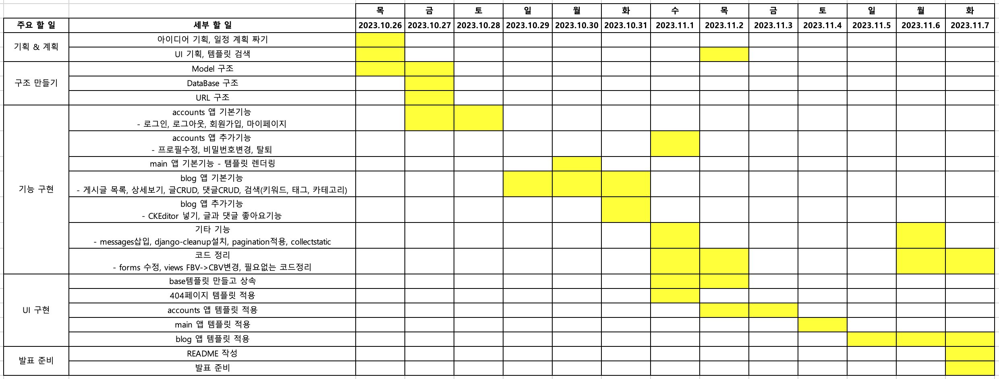
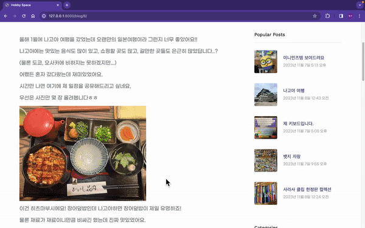

# Hobby Space

## 목차
1. [개요](#1-개요)
2. [사용한 기술스택 및 네이밍 컨벤션](#2-사용한-기술스택-및-네이밍-컨벤션)
3. [프로젝트 구조와 개발 일정](#3-프로젝트-구조와-개발-일정)
4. [요구사항 분석 및 구현 기능 설명](#4-요구사항-분석-및-구현-기능-설명)
5. [UI 및 기능 시연](#5-ui-및-기능-시연)

## 1. 개요

- **Hobby Space**는 취미 공유 블로그입니다.

- 본인의 취미에 대한 글을 쓰고, 게시글을 카테고리와 태그로 분류하여 다른 사람의 취미를 쉽게 알아갈 수 있습니다.
<br><br>

## 2. 사용한 기술스택 및 네이밍 컨벤션

### 2-1. 사용한 기술스택

  

  

### 2-2. 네이밍 컨벤션
- **snake_case** :  Python 변수, 함수, 파일명, 폴더명
- **PascalCase** :  클래스
- **camelCase** :  JavaScript 변수, 함수
- **kebab-case** :  URL, HTML, CSS
- **UPPER_CASE**:  상수
- **is_variable** :  Boolean 값
- **$variable** :  JavaScript HTML DOM 조작
- *Github commit*: `(Gitmoji) Type: Message`

<br><br>

## 3. 프로젝트 구조와 개발 일정

### 3-1. 디렉토리 구조

```bash
<Hobby Space>
├── README.md
├── accounts
│   ├── __init__.py
│   ├── __pycache__
│   ├── admin.py
│   ├── apps.py
│   ├── forms.py
│   ├── migrations
│   │   ├── 0001_initial.py
│   │   ├── __init__.py
│   │   └── __pycache__
│   ├── models.py
│   ├── tests.py
│   ├── urls.py
│   └── views.py
├── blog
│   ├── __init__.py
│   ├── __pycache__
│   ├── admin.py
│   ├── apps.py
│   ├── forms.py
│   ├── migrations
│   │   ├── 0001_initial.py
│   │   ├── __init__.py
│   │   └── __pycache__
│   ├── models.py
│   ├── tests.py
│   ├── urls.py
│   └── views.py
├── db.sqlite3
├── hobby_space
│   ├── __init__.py
│   ├── __pycache__
│   ├── asgi.py
│   ├── settings.py
│   ├── urls.py
│   └── wsgi.py
├── main
│   ├── __init__.py
│   ├── __pycache__
│   ├── admin.py
│   ├── apps.py
│   ├── migrations
│   │   ├── __init__.py
│   │   └── __pycache__
│   ├── models.py
│   ├── tests.py
│   ├── urls.py
│   └── views.py
├── manage.py
├── media
│   ├── accounts
│   │   └── profile
│   │       ├── IMG_1741.jpg
│   │       └── IMG_4539.jpg
│   ├── blog
│   │   └── images
│   │       └── 2023
│   │           └── 11
│   │               └── 07
│   │                   ├── IMG_2960.jpg
│   │                   └── IMG_8469.jpg
│   └── uploads
│       ├── (user1)
│       │   └── 2023
│       │       └── 11
│       │           └── 07
│       │               └── img_2960.jpg
│       └── (user2)
│           └── 2023
│               └── 11
│                   └── 07
│                       └── img_8469.jpg
├── requirements.txt
├── static
│   ├── css
│   ├── fonts
│   ├── images
│   │   ├── about1.jpg
│   │   ├── about2.jpg
│   │   ├── post.jpg
│   │   └── profile.png
│   ├── js
│   └── scss
├── staticfiles
│   ├── admin
│   ├── ckeditor
│   ├── css
│   ├── fonts
│   ├── images
│   ├── js
│   └── scss
├── templates
│   ├── 404.html
│   ├── accounts
│   │   ├── form.html
│   │   └── mypage.html
│   ├── base.html
│   ├── blog
│   │   ├── post_detail.html
│   │   ├── post_form.html
│   │   └── post_list.html
│   └── main
│       ├── about.html
│       ├── contact.html
│       └── index.html
└── venv
```
### 3-2. URL 구조
```
App: main                      | Views Function  | HTML File
----------------------------------------------------------------------------
'/'                            | index           | index.html
'/about/'                      | about           | about.html
'/contact/'                    | contact         | contact.html


App: accounts                  | Views Function  | HTML File
----------------------------------------------------------------------------
'/accounts/login/'             | login           | form.html
'/accounts/logout/'            | logout          | index.html (redirect)
'/accounts/register/'          | register        | form.html

'/accounts/mypage/'            | mypage          | mypage.html
'/accounts/edit/'              | user_edit       | form.html
'/accounts/password/'          | password_edit   | form.html
'/accounts/delete/<int:pk>/'   | user_delete     | mypage.html (modal)


App: blog                      | Views Function  | HTML File
----------------------------------------------------------------------------
'/blog/'                       | post_list       | post_list.html
'/blog/?q='                    | post_list       | post_list.html
'/blog/<int:pk>/'              | post_detail     | post_detail.html

'/blog/write/'                 | write           | post_form.html
'/blog/edit/<int:pk>/'         | edit            | post_form.html
'/blog/delete/<int:pk>/'       | delete          | post_detail.html(modal)

'/blog/<int:post>/comment-new/'| comment_new     | post_detail.html
'/blog/comment-edit/<int:pk>/' | comment_edit    | post_detail.html
'/blog/comment-del/<int:pk>/'  | comment_del     | post_detail.html

'/blog/category/<str:slug>/'   | category_search | post_list.html
'/blog/tag/<str:slug>/'        | tag_search      | post_list.html

'/blog/post-like/<int:id>/'    | post_like       | post_detail.html
'/blog/comment-like/<int:id>/' | comment_like    | post_detail.html
```

### 3-3. 데이터베이스 구조


### 3-4. 개발 일정


<br><br>


## 4. 요구사항 분석 및 구현 기능 설명

### 4-1. 기본 요구사항
- UI 스타일: Bootstrap5 템플릿 이용
- View 개발: 좋아요 기능은 함수형 뷰로, 나머지는 전부 클래스형 뷰로 구현
- 모놀리식 개발 (DRF 사용X)
- 데이터베이스 구조 설계 O

### 4-2. 메인 페이지 구현
- URL: `/`
- 페이지 제목과 블로그 입장하기 버튼
- 로그인 O: 마이페이지, 로그아웃 버튼
- 로그인 X: 로그인, 회원가입 버튼

### 4-3. 회원가입 기능 구현
- URL: `/accounts/register/`
- 회원가입 폼 띄울 페이지 O
- 사용자 이름, 비밀번호, 닉네임, 이메일, 프로필 사진, 소개말을 입력받음

### 4-4. 로그인 기능 구현
- URL: `/accounts/login/`
- 로그인 폼 띄울 페이지 O
- 사용자 이름과 비밀번호를 입력받음

### 4-5. 로그아웃 기능 구현
- URL: `/accounts/logout/`
- 로그아웃 시 메인 페이지로 이동

### 4-6. 회원 관련 추가 기능 구현
- 마이페이지 구현 (로그인 해야 볼 수 있음)
    - URL: `/accounts/mypage/`
    - 유저 프로필 정보
    - 수정, 탈퇴 버튼
    - 본인이 쓴 글과 댓글
    - 좋아요 누른 글과 댓글
- 프로필 수정
- 비밀번호 변경
- 회원 탈퇴

### 4-7. 게시글 작성 기능 구현
- URL: `/blog/write/`
- 로그인을 한 유저만 해당 기능 사용 가능
- 게시글 제목, 내용(CK Editor 이용), 썸네일 사진, 카테고리, 태그를 입력 받음
- 작성한 게시글은 데이터베이스에 저장되어 게시글 목록에서 볼 수 있음
- CK Editor 내에서도 사진 업로드가 가능하고, 이와 별개로 썸네일용 사진은 게시글 목록과 상세보기 상단의 배경사진에 쓰임
- 작성된 게시글 조회수 표시 가능

### 4-8. 게시글 목록 기능 구현
- URL: `/blog/`
- 모든 사용자들이 블로그 게시글의 목록 확인 가능
- 최신 글이 위로 오도록 정렬
- 페이지네이션 구현

### 4-9. 게시글 상세보기 기능 구현
- URL: `/blog/<int:pk>/`
- 작성한 게시글의 상세 내용을 볼 수 있음
    - 제목, 내용, 썸네일 사진, 글쓴이, 글 쓴 날짜, 카테고리, 태그, 조회수, 좋아요 수, 댓글
- 로그인 한 유저가 관심 있는 글에 좋아요를 눌러 표시할 수 있음

### 4-10. 게시글 검색 기능 구현
- 키워드 검색, 카테고리 검색, 태그 검색 가능
- URL: `/blog/?q=`, `/blog/category/<str:slug>/`, `/blog/tag/<str:slug>/`
- 검색된 게시물은 최신 글이 위로 오도록 정렬

### 4-11. 게시글 수정 기능 구현
- URL: `/blog/edit/<int:pk>/`
- 로그인을 한 유저만 해당 기능 사용 가능
- 본인의 게시글이 아니라면 수정 불가
- 게시글 제목, 내용, 썸네일 사진, 카테고리, 태그 수정 가능
- 수정할 수 있는 폼 페이지 O
- 수정된 내용은 게시글 목록/상세보기에 반영됨

### 4-12. 게시글 삭제 기능 구현
- URL: `/blog/delete/<int:pk>/`
- 로그인을 한 유저만 해당 기능 사용 가능
- 본인의 게시글이 아니라면 삭제 불가
- 삭제를 완료한 이후에는 게시글 목록으로 돌아감
- 삭제된 게시글은 접근이 불가능하며, 접근 시도시 404페이지를 띄움

### 4-13. 댓글 기능 구현
- 로그인을 한 유저만 해당 기능 사용 가능
- 댓글 추가, 수정, 삭제 가능
- 수정과 삭제는 본인 댓글이어야 가능
- 로그인 한 유저가 관심 있는 댓글에 좋아요를 눌러 표시할 수 있음

### 4-14. 부가 기능
- 정적 파일 모으기(collectstatic): DEBUG=False를 위해 실행함
- 배포 X

### 4-15. 외부 패키지 이용
- django-bootstrap5: Django 탬플릿에 Bootstrap5 탬플릿 태그를 쓸 수 있음
- django-ckeditor: 게시글 내용 입력에 CK Editor를 사용
- django-cleanup: 이미지 필드의 사진을 변경/삭제할 때 필요 없어진 기존 사진이 자동으로 삭제되도록 함
- django-environ: 시크릿 키를 환경변수로 불러와서 외부에 숨길 수 있음

<br><br>

## 5. UI 및 기능 시연

### 5-1. 시작 페이지

**로그인 X**


<br>

**로그인 O**


- 처음 들어갔을 때 보이는 시작 페이지입니다.
- 조회수 높은 게시물 5개를 띄워줍니다.
- 상단 네비게이션바
    - 전체 게시글
    - 카테고리별 게시글
    - 기타 정보 (About, Contact페이지)
    - 로그인 / 회원가입 (로그인X)
    - 마이페이지 / 로그아웃 (로그인O)
    - 키워드 검색
---
### 5-2. 회원 가입 & 로그인, 로그아웃


- 폼을 이용하여 유저 정보를 입력 받습니다.
- 회원가입 완료 시 자동 로그인되어 마이페이지로 이동합니다.

<br>


- 회원가입과 같은 HTML파일을 쓰지만 로그인할 때에는 로그인 폼을 띄워줍니다.
- 로그인 시 마이페이지, 로그아웃 시 메인 페이지로 이동합니다.
---
### 5-3. 마이페이지 & 프로필 수정, 비밀번호 변경, 회원 탈퇴


- 마이페이지에서 프로필 수정, 비밀번호 변경, 회원 탈퇴가 가능합니다.
- 프로필 수정 시 사용자 이름(ID)은 변경 불가합니다.
---
### 5-4. 게시글 목록 보기 & 검색


- 게시글 목록을 보여줍니다.
- 오른쪽에는 조회수 높은 순으로 3개의 인기 게시물을 보여줍니다.
- 그 밑은 전체 카테고리와 전체 태그를 보여줘서 검색하기 쉽도록 합니다.
- 카테고리 검색, 태그별 검색, 키워드 검색(오른쪽 상단)이 가능합니다.
- 로그인을 하면 글쓰기 버튼이 생겨 글을 쓸 수 있습니다.
---
### 5-5. 게시글 쓰기, 수정, 삭제


- 로그인 한 유저는 글을 쓸 수 있습니다.
- 제목, 내용, 썸네일 사진, 카테고리, 태그를 선택할 수 있습니다.
- 내용은 CK Editor로 작성이 가능하고 사진도 여러장 올릴 수 있습니다.

<br>


- 글은 본인이 쓴 글만 수정, 삭제가 가능합니다.
- 삭제 후 접근하려고 하면 404에러가 뜹니다.
---
### 5-6. 댓글 쓰기, 수정, 삭제


- 로그인 한 유저는 댓글을 쓸 수 있습니다.
- 댓글은 본인이 쓴 댓글만 수정, 삭제가 가능합니다.
---
### 5-7. 글, 댓글 좋아요


- 로그인 한 유저는 글과 댓글에 좋아요를 누를 수 있습니다.
- 좋아요를 누른 글과 댓글은 마이페이지에서 모아 볼 수 있습니다.
---
### 5-8. 네비게이션바 & About, Contact 페이지


- 네비게이션바의 Info에서 About, Contact 페이지에 들어갈 수 있습니다.
- 또한 네비게이션바의 Category를 통해 카테고리별 분류를 쉽게 접근할 수 있습니다.
- Posts는 전체 글 목록을 볼 수 있고, Hobby Space를 누르면 메인 페이지로 이동합니다.
<br><br>

## 6. 개발 후기
- 이번 프로젝트를 통해 Django의 여러가지 기능을 사용하여 개발을 하였습니다. 개발하면서 클래스형 뷰를 사용하는 법을 더 잘 알게 되었고 오히려 함수형 뷰보다 다루기 쉽다고 느껴졌습니다. 자주 쓰이는 기능들이 클래스로 미리 구현된 것이다보니 그렇다고 생각됩니다.

- 또한 이번 프로젝트를 통해 Bootstrap도 좀 더 익히게 되었습니다. Bootstrap에 쓰이는 클래스들을 잘 몰랐는데 문서도 찾아보고 직접 적용도 시켜보면서 쓰다보니 익숙해진 느낌이 듭니다.